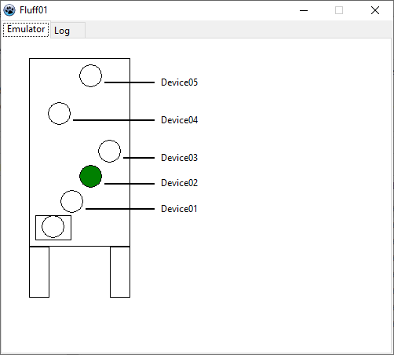

# Step-Layer
Step Layer

Keyword:
 - TStringList
 - Step Event / Layer
 - Communication between application using SimpleIPC

 

Version 03
 - Increased ability to support adding/removing patterns.
 - Ready to extend pattern
 - Give meaning according to the needs.

Version 02
 - Fix the issue if the pattern doesn't match the layer.

Version 01
 - Fix pattern
